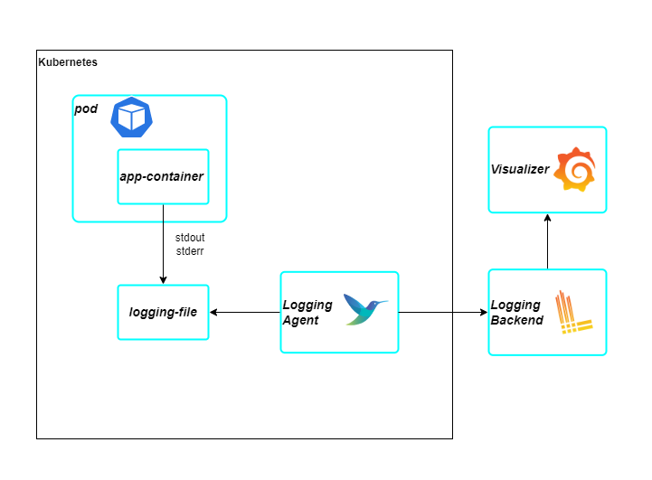
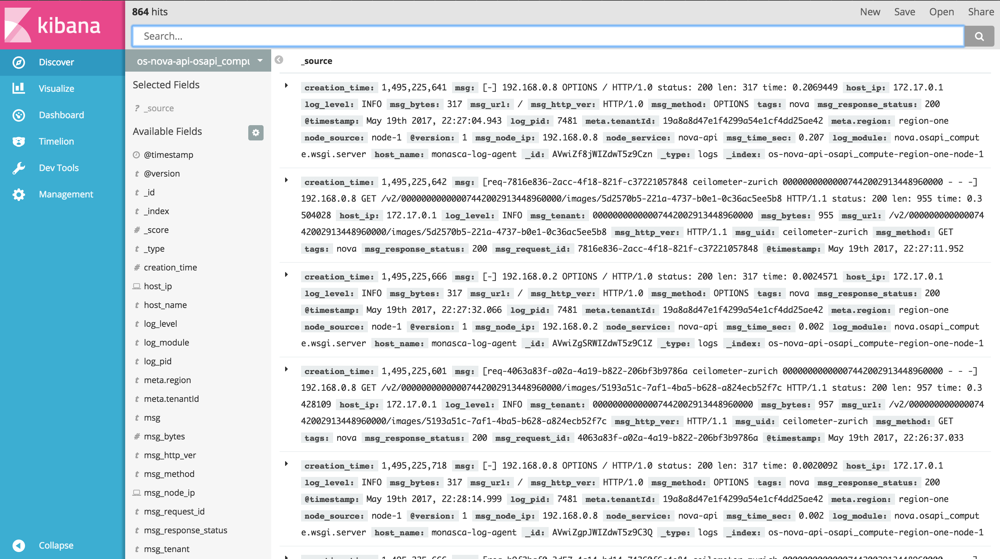

# Logging

## Log Collecting
Khi các application logging ra file hoặc stdout/stderr thì việc collect logs sẽ được deligate cho các logging agents.
Cách áp dụng này sẽ tránh cho việc phải config thông tin logging backend ở nhiều nơi.

- Các application container chạy trên kubernetes sẽ output log ra stderr/stdout.
- Logging agent (promtail,fluentbit, fluentd, grafana agent) sẽ làm nhiệm vụ đi collect log từ các container và gửi đến logging backend.
- Logging backend (loki, elasticsearch...) sẽ là nơi lưu trữ logs. Việc deploy logging backend cần chú ý đến việc áp dụng scalable storage và data retention strategy do lượng log được ingest có thể rất lớn, phải cân nhắc đến tính hiệu quả của log tránh lưu quá nhiều log không cần thiết, đông thời cũng phải lưu đủ log cần thiết cho việc debug system.

### Log collecting status
| **Component** | As-is | To-be |
| ----------- | ----------- |----------- |
| Frontend App | Not logging to stdout/stderr yet | Logging to stdout/stderr |
| Backend App | Logging to stdout/stderr (not preperly implemented) | Logging to stdout/stderr (properly implemented) |
| Database | Not intergrated to logging backend | Intergrated to logging backend |

## Log formatting
Các library theo các framework với các default output log settings có thể được tận dụng.
Tuy nhiên có một số thông tin có thể được đưa vào log output để dễ dàng hơn trong việc debug.
 - `Correlation ID` : được khởi tạo từ client hoặc service đầu tiên xử lý request. Correlation ID sẽ được passing sang các service tiếp theo xử lý request.
 Việc này sẽ giúp cho việc query các log liên quan đến lỗi dễ dàng hơn và xác định được request đã được xử lý ở service nào.
 - `User ID` : khi một user báo cáo hệ thống lỗi, nếu các request của user đều được gắn user id thì khi query log với param là user id và error code sẽ giảm thời gian xác định nguyên nhân request bị lỗi.
 - `Datetime` : thường các logging library của framework đã bao gồm sẵn việc logging ngày giờ. Tuy nhiên có thể chuẩn hoá lại Datetime format theo nhu cầu business.

Việc log output được định dạng là `text` hoặc `json` có thể giúp log colecter transform dữ liệu nhanh hơn tuỳ vào các tool được sử dụng.

## Log Visualizer
Các log visualizer sẽ giúp cho việc query và view log được trực quan hơn.
Tuỳ vào stack được sử dụng, các tool như grafana và kibana có thể được tận dụng theo stack phù hợp.

