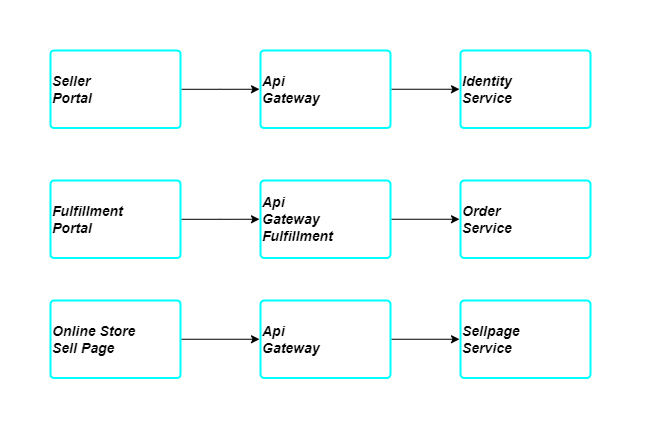

# Uptime

## Websites
- `online store/storefront` for customer to browse products and make purchase
- `seller portal` for seller to promote products and create sell pages
- `fulfillment` for fulfiller to complete order and make changes to shipping status

## Direct dependancy of websites



## Health check
Websites should have health check url to identify if the websites is online

For example
```
https://onlinestore.e2way.co/status
```
The url should return status code 200 if the websites itself and all direct dependencies is up.

If the response code is not 200, that means that the website is not healthy and count as downtime.

## SLA
At the moment, Websites should give SLA uptime of 99%, which means following possible periods of Downtime

- Per Day 4 minutes 26 seconds
- Per Week 10 minutes 5 seconds
- Per Month 43 minutes 50 seconds
- Per Year 8 hours 45 minutes 57 seconds